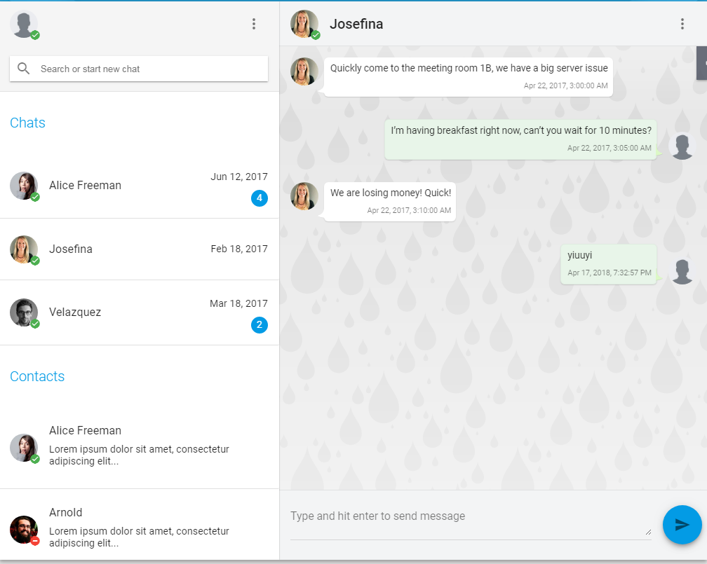

# Angular5-Chat

The chatting app like slack



## About
This project is based on Angular-cli and specialized in Angular 5, Socket.io, Material design and Bootstrap.
Making the project with registering, sign in, reSetting password and Management users easily. This Chat example is written by [Big Silver].

## Development Installation

In the project's directory, run the following commands:

```bash
# Clone our repo
$ git clone https://github.com/Big-Silver/Angular5-Chat.git Angular5-Chat

# Change directory to your app
$ cd Angular5-Chat

# Install the project
$ npm Install

# Run the project
$ npm start

```
Then Visit

```bash
http://localhost:4200
```

## Backend

Please setup the following backend project on your end.
```bash
https://github.com/Big-Silver/Node-Chat.git
```